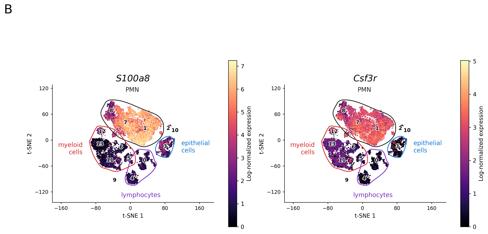
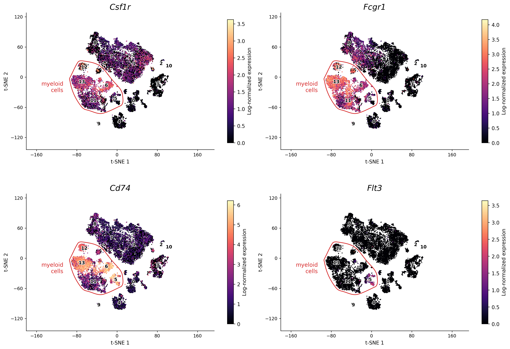
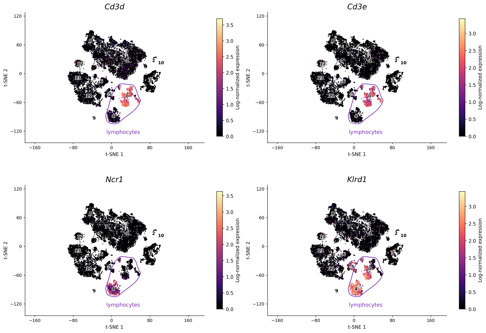
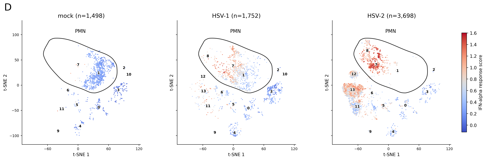

# Reproducing Figure 3 — A sustained type I IFN-neutrophil-IL-18 axis drives pathology during mucosal viral infection

We use Python/Scanpy to approximate the paper's R/Seurat analysis and redraw Figure 3E from the published ELISA measurements.

## High-level reproduction steps

1. Load the seven samples and remove cells with >5% mitochondrial counts.
2. Perform initial clustering and remove clusters with median detected genes <500.
3. Normalize, select 3,000 HVGs, regress total UMI, scale and run PCA.
4. Cluster cells and plot t-SNE and cell-type markers.
5. Plot mock/day-5 condition panels and IFN-alpha response scores.
6. Redraw Figure 3E using the separate ELISA source data.

## Gap analysis

#### Sample selection

The paper reports 21,633 cells after QC; our pooled mock/day-1,3,5 matrices retain 20,795 cells after the mitochondrial filter. Our embedding uses all seven samples; Figures C/D display only mock/day-5 cells.

#### Cluster-based QC

The paper removes three low-gene clusters without specifying the cluster statistic or initial clustering settings. Our median-gene cutoff removes four clusters, retaining **17,578 cells**.

#### UMI regression

The paper uses negative-binomial regression; we use Scanpy's linear regression on log-normalized expression. Their residuals and downstream clusters can differ.

#### Clustering and annotation

The paper does not report its final PC count or resolution; we use **40 PCs, 30 neighbors and Leiden resolution 0.4**, yielding **14 clusters** in the latest saved run versus the paper's 17. Cluster IDs are not interchangeable; the chart below uses provisional annotations for our current 14-cluster run.

#### Figure 3A marker selection

The paper specifies S100a8/Csf3r for neutrophils but does not list the markers used to annotate the other Figure 3A groups. We use candidate mouse markers from PanglaoDB and these group assignments remain provisional.

#### IFN-alpha scoring

Figure 3D uses a current mouse Hallmark gene set and Scanpy's control-adjusted expression score. The checked text does not specify the exact scoring formula or function, including whether control genes were subtracted.

## Reproduce outcomes

#### Figure 3A

PMN are myeloid cells, shown separately as in the paper. Clusters **2, 9 and 10** remain unassigned; outlines indicate candidate groups, not exact boundaries.

##### Extra: Marker evidence for the new clusters

These candidate mouse markers come from the PanglaoDB marker database. Only **S100a8/Csf3r** are specified for neutrophil annotation in the paper; the other groups remain provisional.

| Broad group | Cell type                       | Typical marker genes                                       |
| ----------- | ------------------------------- | ---------------------------------------------------------- |
| Myeloid     | **Neutrophils**                 | **S100a8, S100a9, Csf3r, Ly6g**                            |
| Myeloid     | Monocytes                       | Lyz2, Lst1, Ccr2, Ly6c2                                    |
| Myeloid     | Macrophages                     | Adgre1 (*F4/80*), Csf1r, C1qa, C1qb                        |
| Myeloid     | Dendritic cells                 | Itgax, H2-Ab1, Cd74; subtype markers help distinguish them |
| Lymphocytes | **T cells**                     | **Cd3d, Cd3e, Trac**                                       |
| Lymphocytes | **B cells**                     | **Cd79a, Cd79b, Ms4a1, Cd19**                              |
| Lymphocytes | NK cells                        | Nkg7, Ncr1, Klrd1; little/no Cd3d or Cd3e                  |
| Epithelial  | **Epithelial cells**            | **Epcam, Krt8, Krt18, Krt19**                              |
| Epithelial  | Basal/squamous epithelial cells | Krt5, Krt14, Trp63                                         |

##### Selected markers

| Group         | Selected markers                                                 |
| ------------- | ---------------------------------------------------------------- |
| PMN           | S100a8, Csf3r                                                    |
| Other myeloid | Csf1r, Fcgr1 (monocytes/macrophages); Cd74, Flt3 (DC assessment) |
| Epithelial    | Epcam, Krt5, Krt14, Krt18                                        |
| Lymphocytes   | Cd3d, Cd3e (T); Ncr1, Klrd1 (NK)                                 |

#### Figure 3B

S100a8 and Csf3r expression, with the same candidate group outlines as Figure 3A.

##### Extra: Markers for other cell types

**Other myeloid cells:** Csf1r, Fcgr1, Cd74 and Flt3.

**Epithelial cells:** Epcam, Krt5, Krt14 and Krt18.

**Lymphocytes:** Cd3d/Cd3e for T cells; Ncr1/Klrd1 for NK cells.

#### Figure 3C

Mock and day-5 HSV-1/HSV-2 cells, using the shared all-sample t-SNE embedding and cluster colors. Only PMN are outlined.

#### Figure 3D

The same conditions colored by IFN-alpha response score. Scoring approximates the paper's method.

##### Calculation

- **Input:** full-gene log-normalized expression in `adata.raw`.
- **Gene set:** mouse `HALLMARK_INTERFERON_ALPHA_RESPONSE` (MSigDB MM3877, downloaded 2026-09-23); **89/94 genes matched with QCed genes**.
- **Per-cell score:** mean expression of matched IFN-alpha genes minus mean expression of expression-matched control genes, using Scanpy `score_genes` (`ctrl_size=50`, `n_bins=25`, `ctrl_as_ref=True`, seed 42).
- **Display:** score all retained cells together, then show mock/day-5 cells on the existing t-SNE. All panels share the displayed cells' score minimum/maximum and the same PMN outline. This score measures relative gene-set expression, not IFN-alpha protein concentration.
