# Reproducing Figure 3 — A sustained type I IFN-neutrophil-IL-18 axis drives pathology during mucosal viral infection

This reports show both paper figure reproduce with Python-Scanpy and R-Seurat

## High-level reproduction steps

1. Load the seven samples and remove cells with >5% mitochondrial counts.
2. Perform initial clustering and remove clusters with median detected genes <500.
3. Normalize, select 3,000 HVGs, regress total UMI, scale and run PCA.
4. Cluster cells and plot t-SNE and cell-type markers.
5. Plot mock/day-5 condition panels and IFN-alpha response scores.
6. Redraw Figure 3E using the separate ELISA source data.

## Exploratory analysis

### Sample total gene counts and unique genes

<table>
  <thead>
    <tr><th rowspan="2">Sample</th><th rowspan="2">Condition</th><th rowspan="2">Total reads (ENA)</th><th colspan="3">Before QC</th><th colspan="3">After QC (Seurat)</th></tr>
    <tr><th>Cells</th><th>UMI</th><th>Median mouse genes/cell</th><th>Cells</th><th>UMI</th><th>Median mouse genes/cell</th></tr>
  </thead>
  <tbody>
    <tr><td>GSM4905024</td><td>mock</td><td>349,393,689</td><td>2,119</td><td>11,217,519</td><td>1,153.0</td><td>1,485</td><td>8,674,113</td><td>1,239.0</td></tr>
    <tr><td>GSM4905025</td><td>HSV-1 day 1</td><td>329,855,668</td><td>2,764</td><td>18,485,658</td><td>1,145.5</td><td>1,491</td><td>12,427,504</td><td>1,393.0</td></tr>
    <tr><td>GSM4905026</td><td>HSV-2 day 1</td><td>364,128,507</td><td>3,300</td><td>22,356,332</td><td>1,188.0</td><td>2,196</td><td>15,955,237</td><td>1,330.5</td></tr>
    <tr><td>GSM4905027</td><td>HSV-1 day 3</td><td>372,867,577</td><td>4,715</td><td>45,165,593</td><td>1,968.0</td><td>3,549</td><td>38,653,781</td><td>2,302.0</td></tr>
    <tr><td>GSM4905028</td><td>HSV-2 day 3</td><td>414,947,993</td><td>4,318</td><td>22,374,708</td><td>1,059.0</td><td>3,272</td><td>19,886,678</td><td>1,247.5</td></tr>
    <tr><td>GSM4905029</td><td>HSV-1 day 5</td><td>371,353,516</td><td>3,488</td><td>17,709,707</td><td>567.0</td><td>1,720</td><td>13,279,914</td><td>1,272.5</td></tr>
    <tr><td>GSM4905030</td><td>HSV-2 day 5</td><td>363,058,503</td><td>4,529</td><td>37,440,142</td><td>1,656.0</td><td>3,667</td><td>34,540,391</td><td>1,984.0</td></tr>
    <tr><td><strong>Total</strong></td><td></td><td><strong>2,565,605,453</strong></td><td><strong>25,233</strong></td><td><strong>174,749,659</strong></td><td>—</td><td><strong>17,380</strong></td><td><strong>143,417,618</strong></td><td>—</td></tr>
  </tbody>
</table>

### Mouse and viral UMI counts

<table>
  <thead>
    <tr><th rowspan="2">Sample</th><th rowspan="2">Condition</th><th colspan="3">Before QC</th><th colspan="3">After QC (Seurat)</th></tr>
    <tr><th>Mouse</th><th>HSV-1</th><th>HSV-2</th><th>Mouse</th><th>HSV-1</th><th>HSV-2</th></tr>
  </thead>
  <tbody>
    <tr><td>GSM4905024</td><td>mock</td><td>11,214,549</td><td>2,970</td><td>0</td><td>8,674,109</td><td>4</td><td>0</td></tr>
    <tr><td>GSM4905025</td><td>HSV-1 day 1</td><td>18,324,747</td><td>160,911</td><td>0</td><td>12,298,130</td><td>129,374</td><td>0</td></tr>
    <tr><td>GSM4905026</td><td>HSV-2 day 1</td><td>22,353,220</td><td>3,112</td><td>0</td><td>15,955,182</td><td>55</td><td>0</td></tr>
    <tr><td>GSM4905027</td><td>HSV-1 day 3</td><td>44,793,207</td><td>372,386</td><td>0</td><td>38,318,697</td><td>335,084</td><td>0</td></tr>
    <tr><td>GSM4905028</td><td>HSV-2 day 3</td><td>22,368,663</td><td>6,045</td><td>0</td><td>19,885,574</td><td>1,104</td><td>0</td></tr>
    <tr><td>GSM4905029</td><td>HSV-1 day 5</td><td>17,699,651</td><td>10,056</td><td>0</td><td>13,275,674</td><td>4,240</td><td>0</td></tr>
    <tr><td>GSM4905030</td><td>HSV-2 day 5</td><td>37,436,126</td><td>4,016</td><td>0</td><td>34,540,355</td><td>36</td><td>0</td></tr>
  </tbody>
</table>

### Normalized counts (UMI per 10,000)

<table>
  <thead>
    <tr><th rowspan="2">Sample</th><th rowspan="2">Condition</th><th colspan="3">Before QC</th><th colspan="3">After QC (Seurat)</th></tr>
    <tr><th>Mouse</th><th>HSV-1</th><th>HSV-2</th><th>Mouse</th><th>HSV-1</th><th>HSV-2</th></tr>
  </thead>
  <tbody>
    <tr><td>GSM4905024</td><td>mock</td><td>9,725.845</td><td>274.155</td><td>0.000</td><td>9,999.995</td><td>0.005</td><td>0.000</td></tr>
    <tr><td>GSM4905025</td><td>HSV-1 day 1</td><td>9,917.521</td><td>82.479</td><td>0.000</td><td>9,887.160</td><td>112.840</td><td>0.000</td></tr>
    <tr><td>GSM4905026</td><td>HSV-2 day 1</td><td>9,836.027</td><td>163.973</td><td>0.000</td><td>9,999.111</td><td>0.889</td><td>0.000</td></tr>
    <tr><td>GSM4905027</td><td>HSV-1 day 3</td><td>9,898.384</td><td>101.616</td><td>0.000</td><td>9,884.344</td><td>115.656</td><td>0.000</td></tr>
    <tr><td>GSM4905028</td><td>HSV-2 day 3</td><td>9,866.059</td><td>133.941</td><td>0.000</td><td>9,998.391</td><td>1.609</td><td>0.000</td></tr>
    <tr><td>GSM4905029</td><td>HSV-1 day 5</td><td>9,841.925</td><td>158.075</td><td>0.000</td><td>9,991.489</td><td>8.511</td><td>0.000</td></tr>
    <tr><td>GSM4905030</td><td>HSV-2 day 5</td><td>9,877.244</td><td>122.756</td><td>0.000</td><td>9,999.438</td><td>0.562</td><td>0.000</td></tr>
  </tbody>
</table>

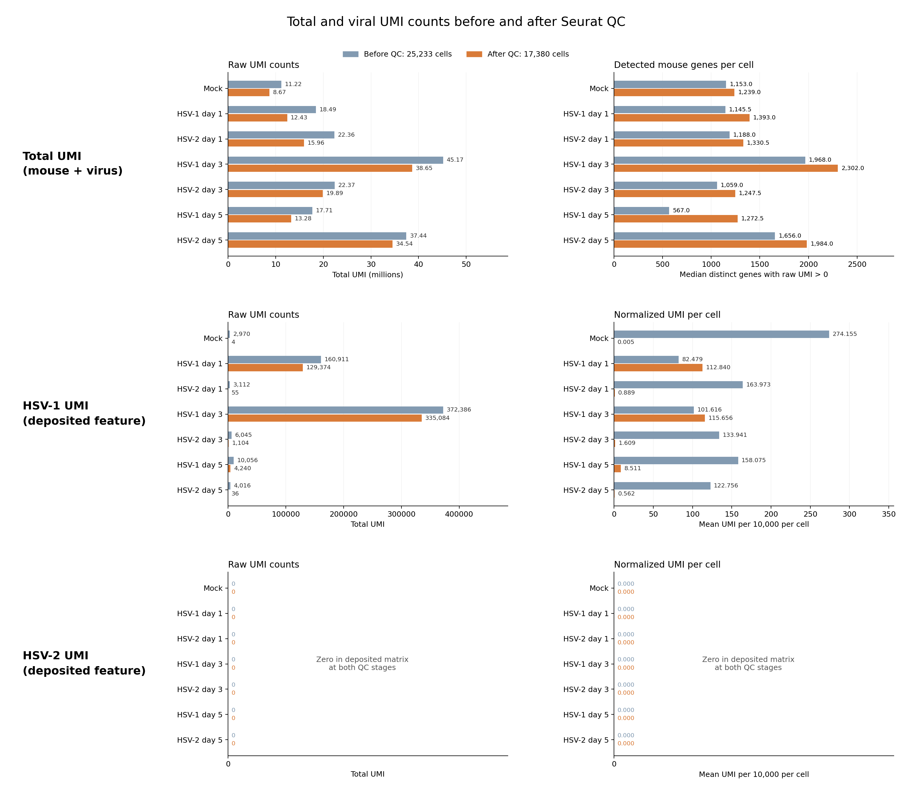

### Cells with detectable viral UMI

<table>
  <thead>
    <tr><th rowspan="2">Sample</th><th rowspan="2">Condition</th><th colspan="2">Before QC</th><th colspan="2">After QC (Seurat)</th></tr>
    <tr><th>HSV-1 positive, n (%)</th><th>HSV-2 positive, n (%)</th><th>HSV-1 positive, n (%)</th><th>HSV-2 positive, n (%)</th></tr>
  </thead>
  <tbody>
    <tr><td>GSM4905024</td><td>mock</td><td>208 (9.82%)</td><td>0 (0.00%)</td><td>2 (0.13%)</td><td>0 (0.00%)</td></tr>
    <tr><td>GSM4905025</td><td>HSV-1 day 1</td><td>1,502 (54.34%)</td><td>0 (0.00%)</td><td>847 (56.81%)</td><td>0 (0.00%)</td></tr>
    <tr><td>GSM4905026</td><td>HSV-2 day 1</td><td>216 (6.55%)</td><td>0 (0.00%)</td><td>10 (0.46%)</td><td>0 (0.00%)</td></tr>
    <tr><td>GSM4905027</td><td>HSV-1 day 3</td><td>3,598 (76.31%)</td><td>0 (0.00%)</td><td>2,804 (79.01%)</td><td>0 (0.00%)</td></tr>
    <tr><td>GSM4905028</td><td>HSV-2 day 3</td><td>530 (12.27%)</td><td>0 (0.00%)</td><td>301 (9.20%)</td><td>0 (0.00%)</td></tr>
    <tr><td>GSM4905029</td><td>HSV-1 day 5</td><td>325 (9.32%)</td><td>0 (0.00%)</td><td>99 (5.76%)</td><td>0 (0.00%)</td></tr>
    <tr><td>GSM4905030</td><td>HSV-2 day 5</td><td>222 (4.90%)</td><td>0 (0.00%)</td><td>11 (0.30%)</td><td>0 (0.00%)</td></tr>
  </tbody>
</table>

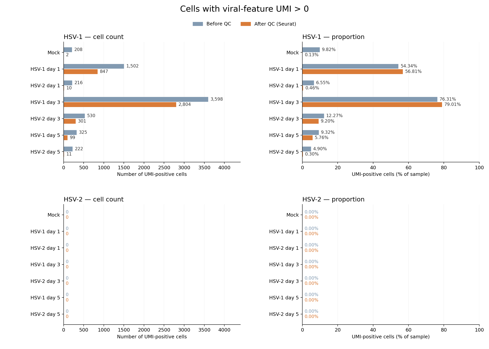

### Median viral UMI percentage in positive cells

<table>
  <thead>
    <tr><th rowspan="2">Sample</th><th rowspan="2">Condition</th><th colspan="2">Before QC</th><th colspan="2">After QC (Seurat)</th></tr>
    <tr><th>HSV-1 median (%)</th><th>HSV-2 median (%)</th><th>HSV-1 median (%)</th><th>HSV-2 median (%)</th></tr>
  </thead>
  <tbody>
    <tr><td>GSM4905024</td><td>mock</td><td>23.5552</td><td>N/A</td><td>0.0340</td><td>N/A</td></tr>
    <tr><td>GSM4905025</td><td>HSV-1 day 1</td><td>0.0328</td><td>N/A</td><td>0.0228</td><td>N/A</td></tr>
    <tr><td>GSM4905026</td><td>HSV-2 day 1</td><td>19.5341</td><td>N/A</td><td>0.0956</td><td>N/A</td></tr>
    <tr><td>GSM4905027</td><td>HSV-1 day 3</td><td>0.0257</td><td>N/A</td><td>0.0226</td><td>N/A</td></tr>
    <tr><td>GSM4905028</td><td>HSV-2 day 3</td><td>0.1190</td><td>N/A</td><td>0.0426</td><td>N/A</td></tr>
    <tr><td>GSM4905029</td><td>HSV-1 day 5</td><td>7.8818</td><td>N/A</td><td>0.0224</td><td>N/A</td></tr>
    <tr><td>GSM4905030</td><td>HSV-2 day 5</td><td>18.4698</td><td>N/A</td><td>0.0123</td><td>N/A</td></tr>
  </tbody>
</table>

### Viral alignments in deposited BAMs

Mapped alignment-record counts from the available BAM files in the same dataset.

| Sample | Condition | Run | HSV-1 alignments | HSV-2 alignments |
|---|---|---|---:|---:|
| GSM4905024 | Mock | [SRR13041474](https://www.ebi.ac.uk/ena/browser/view/SRR13041474) | 6,759 | 14,913 |
| GSM4905025 | HSV-1 day 1 | [SRR13041475](https://www.ebi.ac.uk/ena/browser/view/SRR13041475) | Not checked | Not checked |
| GSM4905026 | HSV-2 day 1 | [SRR13041476](https://www.ebi.ac.uk/ena/browser/view/SRR13041476) | 7,226 | 490,240 |
| GSM4905027 | HSV-1 day 3 | [SRR13041477](https://www.ebi.ac.uk/ena/browser/view/SRR13041477) | Not checked | Not checked |
| GSM4905028 | HSV-2 day 3 | [SRR13041478](https://www.ebi.ac.uk/ena/browser/view/SRR13041478) | 18,783 | 26,607,552 |
| GSM4905029 | HSV-1 day 5 | [SRR13041479](https://www.ebi.ac.uk/ena/browser/view/SRR13041479) | 187,995 | 28,173 |
| GSM4905030 | HSV-2 day 5 | [SRR13041480](https://www.ebi.ac.uk/ena/browser/view/SRR13041480) | Not checked | Not checked |

| Virus | Reference in BAM header | Reference strain |
|---|---|---|
| HSV-1 | [`NC_001806.2`](https://www.ncbi.nlm.nih.gov/nuccore/NC_001806.2) | 17 |
| HSV-2 | [`JN561323.2`](https://www.ncbi.nlm.nih.gov/nuccore/JN561323.2) | HG52 |

### Host-response comparison by virus and day

Cxcl10, Gbp2, Il15 (host response), S100a8 and Csf3r (PMN identity) are compared within candidate PMN clusters **1, 3, 6, 7, 9, 12, 13**.

**HSV-1**

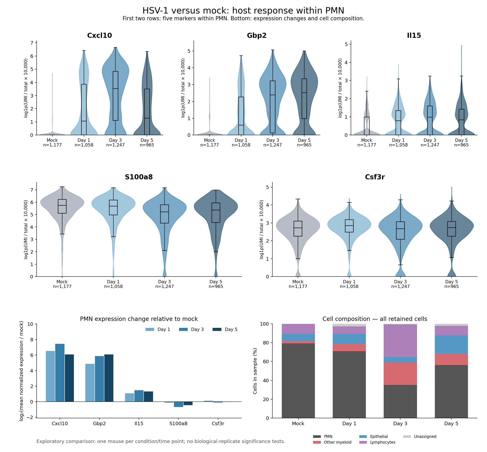

**HSV-2**

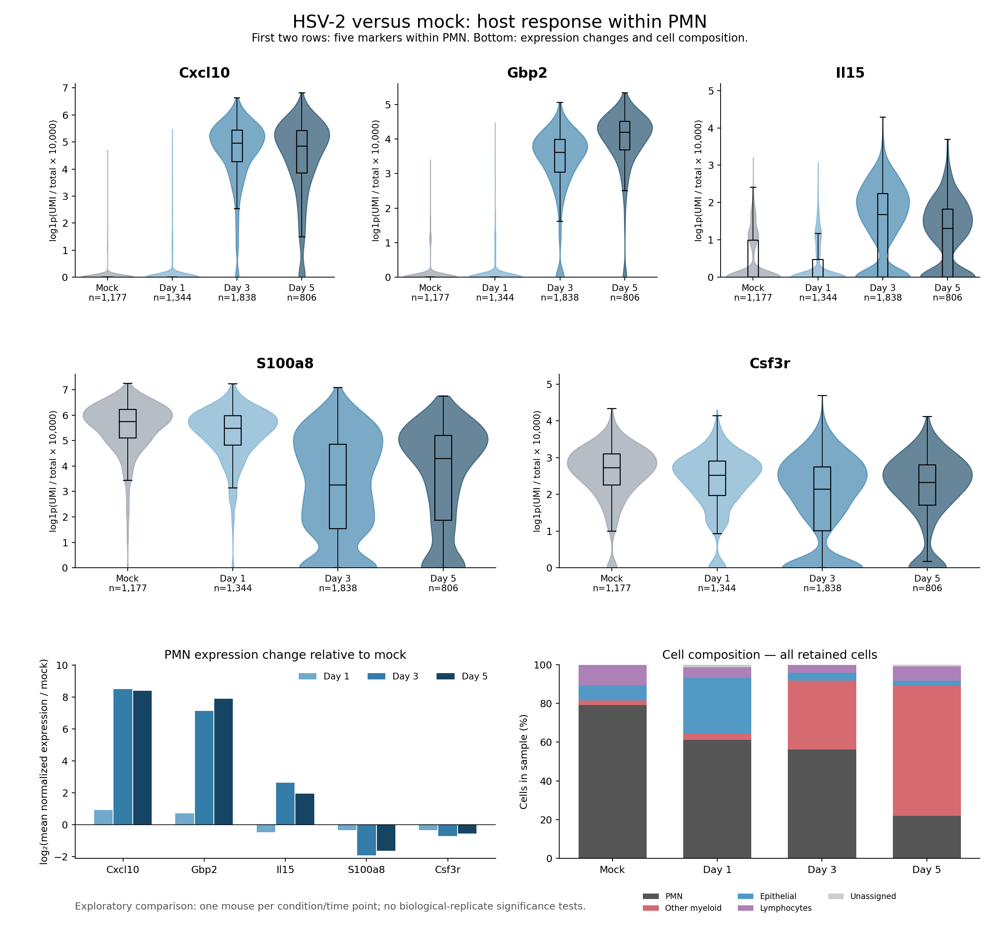

| Marker / measure | HSV-1 observation | HSV-2 observation | Interpretation |
|---|---|---|---|
| Cxcl10 | Increased by day 1; strongest at day 3, lower at day 5 | Low at day 1; high at days 3–5 | Different response timing; more sustained late expression in HSV-2 |
| Gbp2 | Elevated at days 3–5 | Higher expression at days 3–5 | Stronger late host response in the HSV-2 samples |
| Il15 | Modest changes | Increased at days 3–5 | Descriptive trend, not a demonstrated significant difference |
| S100a8 / Csf3r | Expressed in mock and infected-condition PMN | Also expressed in PMN | Cell-identity markers, not evidence of infection on their own |
| PMN proportion | Lower than mock, especially at day 3 | Lowest at day 5, with more other myeloid cells | Cell composition can change while expression within PMN rises |
| Fold change | Large for Cxcl10 / Gbp2 | Large for Cxcl10 / Gbp2 at days 3–5 | Low mock expression magnifies ratios; also inspect the distributions |

One mouse per condition/time point: these are exploratory sample comparisons. Low mock expression can produce large fold changes; captured-cell proportions are not absolute tissue cell counts. Changes in PMN subcluster composition may also contribute to expression differences.

## Gene Markers

Both **Python/Scanpy and R/Seurat** use the same marker panels to assess cell types after clustering. Marker expression is plotted on each workflow's own t-SNE; markers do not define the clusters.

Only **S100a8/Csf3r** are specified for neutrophil annotation in the paper (Figure 3B). The other markers are candidates from PanglaoDB, and their annotations remain provisional.

### Reference markers

| Broad group | Cell type                       | Typical marker genes                                       |
| ----------- | ------------------------------- | ---------------------------------------------------------- |
| Myeloid     | **Neutrophils**                 | **S100a8, S100a9, Csf3r, Ly6g**                            |
| Myeloid     | Monocytes                       | Lyz2, Lst1, Ccr2, Ly6c2                                    |
| Myeloid     | Macrophages                     | Adgre1 (*F4/80*), Csf1r, C1qa, C1qb                        |
| Myeloid     | Dendritic cells                 | Itgax, H2-Ab1, Cd74; subtype markers help distinguish them |
| Lymphocytes | **T cells**                     | **Cd3d, Cd3e, Trac**                                       |
| Lymphocytes | **B cells**                     | **Cd79a, Cd79b, Ms4a1, Cd19**                              |
| Lymphocytes | NK cells                        | Nkg7, Ncr1, Klrd1; little/no Cd3d or Cd3e                  |
| Epithelial  | **Epithelial cells**            | **Epcam, Krt8, Krt18, Krt19**                              |
| Epithelial  | Basal/squamous epithelial cells | Krt5, Krt14, Trp63                                         |

### Markers plotted in both workflows

| Group         | Selected markers                                                 |
| ------------- | ---------------------------------------------------------------- |
| PMN           | S100a8, Csf3r                                                    |
| Other myeloid | Csf1r, Fcgr1 (monocytes/macrophages); Cd74, Flt3 (DC assessment) |
| Epithelial    | Epcam, Krt5, Krt14, Krt18                                        |
| Lymphocytes   | Cd3d, Cd3e (T); Ncr1, Klrd1 (NK)                                 |

## R-Seurat results

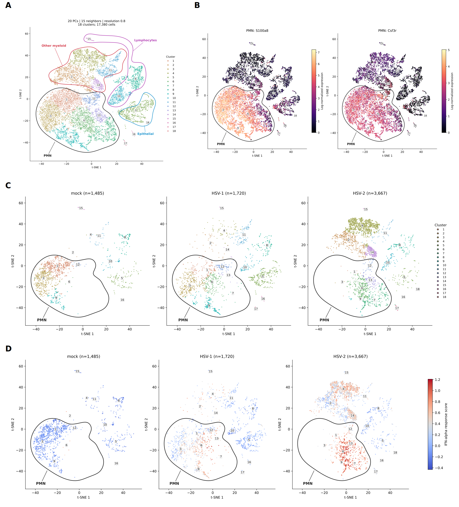

#### Figure 3A

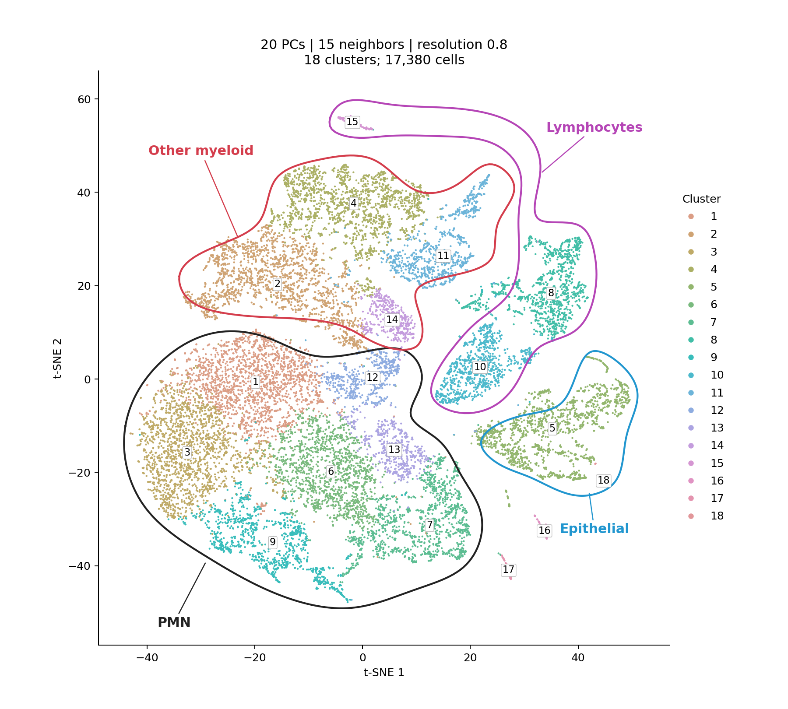

| Candidate type | R cluster IDs |
|---|---|
| PMN | 1, 3, 6, 7, 9, 12, 13 |
| Other myeloid | 2, 4, 11, 14 |
| Epithelial | 5, 18 |
| Lymphocytes | 8, 10, 15 |

Clusters **16 and 17** remain unassigned. Lymphocytes share one outline; its connecting section is only a visual guide. These are provisional marker-based annotations for this R run. Outlines are manually placed visual guides, not exact boundaries. Extra marker panels outline only the relevant type; Figures 3C/D outline only PMN.

#### Figure 3B

S100a8 and Csf3r log-normalized expression, with cluster IDs on both panels.

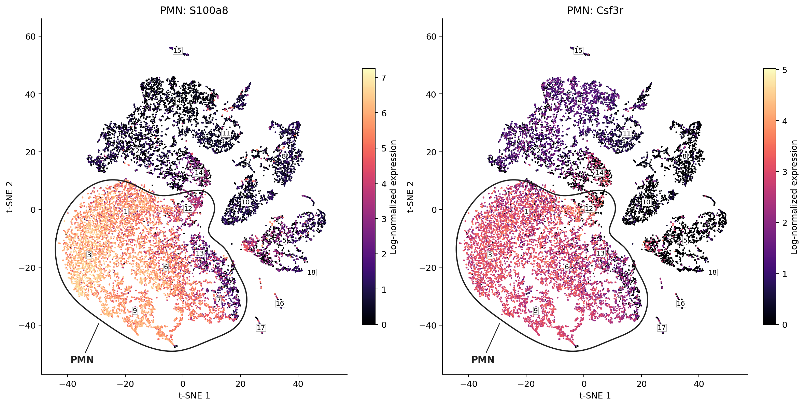

##### Extra: Markers for other cell types

**Other myeloid cells:** Csf1r, Fcgr1, Cd74 and Flt3.

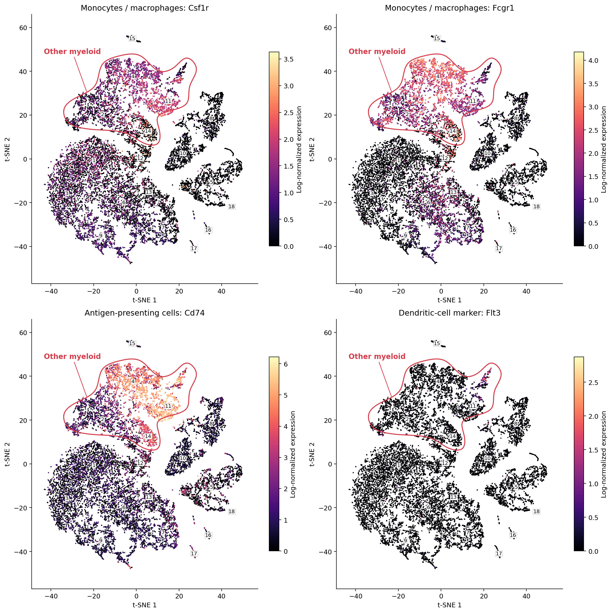

**Epithelial cells:** Epcam, Krt5, Krt14 and Krt18.

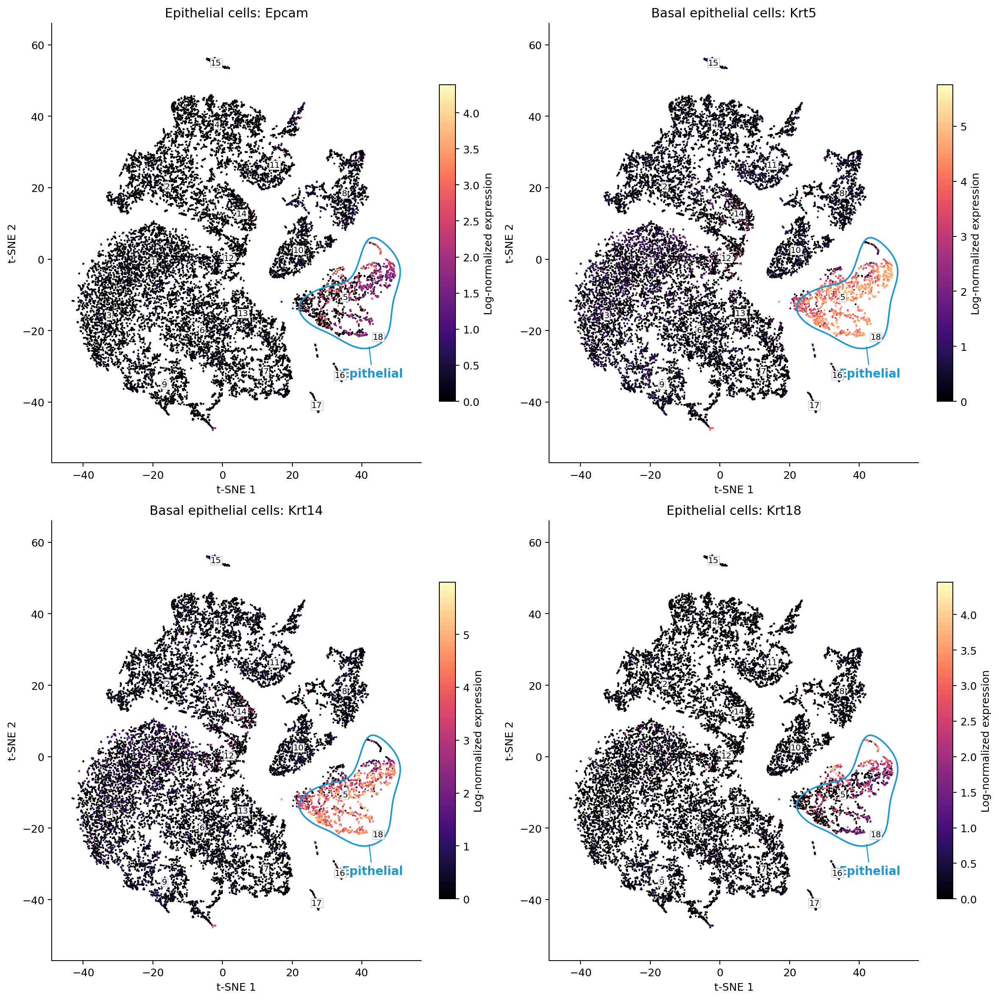

**Lymphocytes:** Cd3d/Cd3e for T cells; Ncr1/Klrd1 for NK cells.

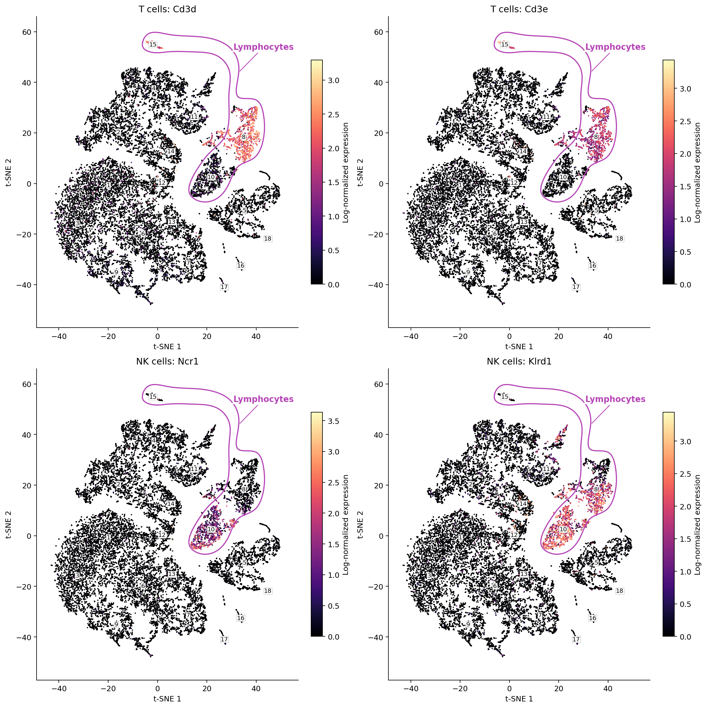

#### Figure 3C

Mock and day-5 HSV-1/HSV-2 cells on the shared all-sample t-SNE. No reclustering.

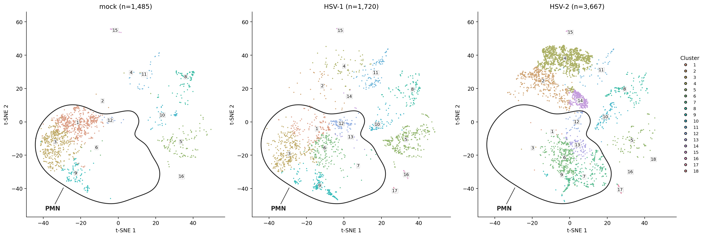

#### Figure 3D

The same conditions colored by IFN-alpha response score.

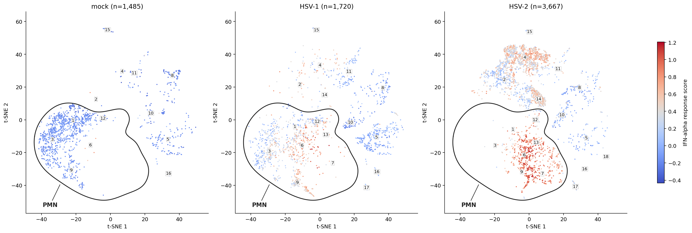

##### Calculation

- **Input:** full-gene log-normalized RNA expression, not regression residuals.
- **Gene set:** mouse Hallmark IFN-alpha response; **89/94 genes matched**.
- **Per-cell score:** target-gene mean minus control-gene mean, using `AddModuleScore` (`nbin=25`, `ctrl=50`, seed 42). Control sampling differs from Scanpy.
- **Display:** score all retained cells, then display mock/day-5 cells with a shared color scale.

## Python-Scanpy results

#### Figure 3A

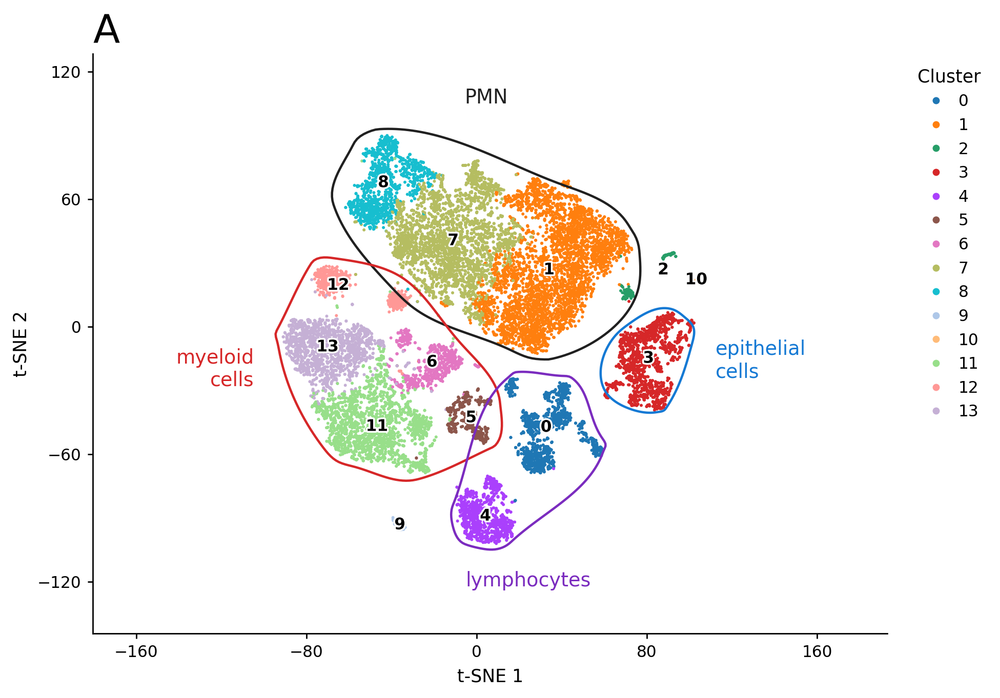

PMN are myeloid cells, shown separately as in the paper. Clusters **2, 9 and 10** remain unassigned; outlines indicate candidate groups, not exact boundaries.

#### Figure 3B

S100a8 and Csf3r expression, with the same candidate group outlines as Figure 3A.

##### Extra: Markers for other cell types

**Other myeloid cells:** Csf1r, Fcgr1, Cd74 and Flt3.

**Epithelial cells:** Epcam, Krt5, Krt14 and Krt18.

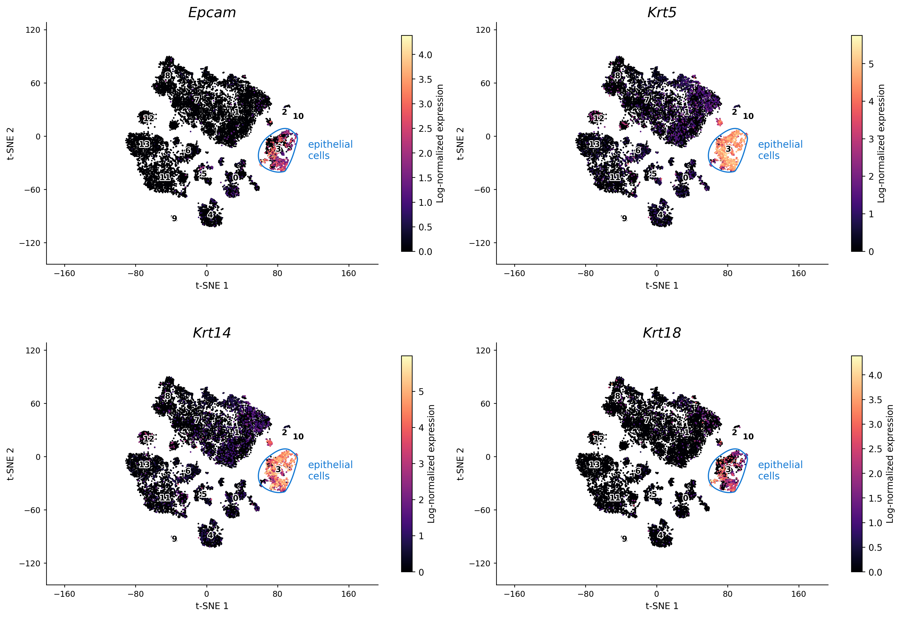

**Lymphocytes:** Cd3d/Cd3e for T cells; Ncr1/Klrd1 for NK cells.

#### Figure 3C

Mock and day-5 HSV-1/HSV-2 cells, using the shared all-sample t-SNE embedding and cluster colors. Only PMN are outlined.

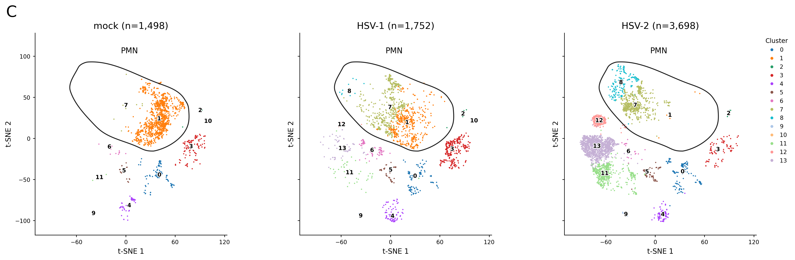

#### Figure 3D

The same conditions colored by IFN-alpha response score. Scoring approximates the paper's method.

##### Calculation

- **Input:** full-gene log-normalized expression in `adata.raw`.
- **Gene set:** mouse `HALLMARK_INTERFERON_ALPHA_RESPONSE` (MSigDB MM3877, downloaded 2026-09-23); **89/94 genes matched with QCed genes**.
- **Per-cell score:** mean expression of matched IFN-alpha genes minus mean expression of expression-matched control genes, using Scanpy `score_genes` (`ctrl_size=50`, `n_bins=25`, `ctrl_as_ref=True`, seed 42).
- **Display:** score all retained cells together, then show mock/day-5 cells on the existing t-SNE. All panels share the displayed cells' score minimum/maximum and the same PMN outline. This score measures relative gene-set expression, not IFN-alpha protein concentration.

## Gap analysis

#### Sample selection

The paper reports 21,633 cells after QC; our pooled mock/day-1,3,5 matrices retain 20,795 cells after the mitochondrial filter. Our embedding uses all seven samples; Figures C/D display only mock/day-5 cells.

#### Cluster-based QC

The paper removes three low-gene clusters without specifying the cluster statistic or initial clustering settings. Our median-gene cutoff removes four clusters in each workflow, retaining **17,578 cells in Scanpy** and **17,380 in Seurat**.

#### UMI regression

The paper uses negative-binomial regression. Scanpy uses linear regression; Seurat uses negative-binomial regression, with 15 failed fits handled by its built-in fallback. Downstream clusters can differ.

#### Clustering and annotation

The paper does not report its final PC count or resolution; the selected Seurat run uses **20 PCs, 15 neighbors and Leiden resolution 0.8**, yielding **18 clusters**. The Scanpy run uses **40 PCs, 30 neighbors and resolution 0.4**, yielding **14 clusters**, versus the paper's 17. Cluster IDs are not interchangeable between workflows.

#### Figure 3A marker selection

The paper specifies S100a8/Csf3r for neutrophils but does not list the markers used to annotate the other Figure 3A groups. We use candidate mouse markers from PanglaoDB and these group assignments remain provisional.

#### IFN-alpha scoring

Figure 3D uses a current mouse Hallmark gene set with Scanpy `score_genes` or Seurat `AddModuleScore`. The checked text does not specify the exact scoring formula or function, including whether control genes were subtracted.
